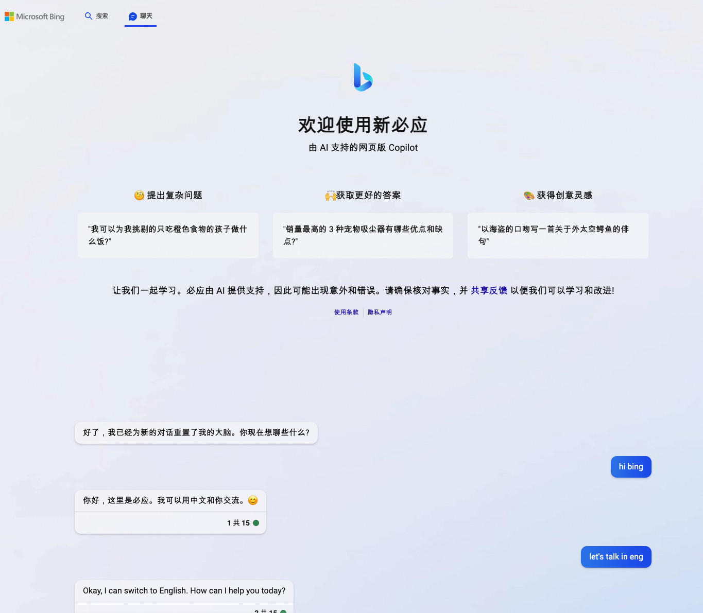
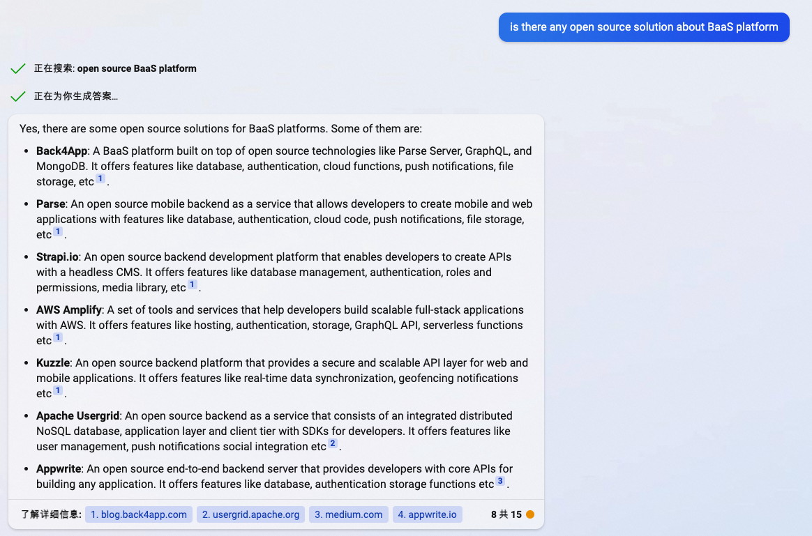
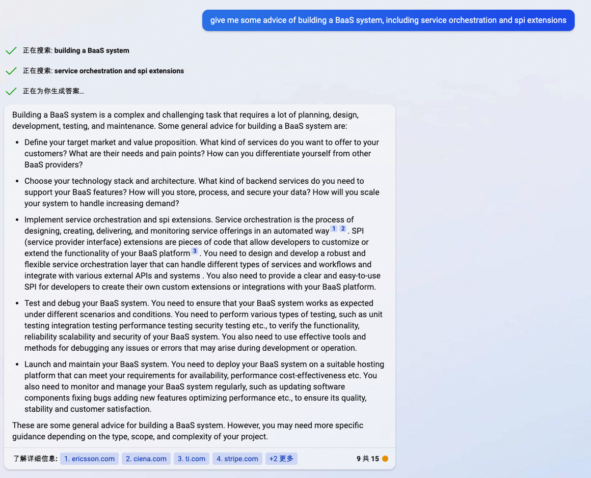
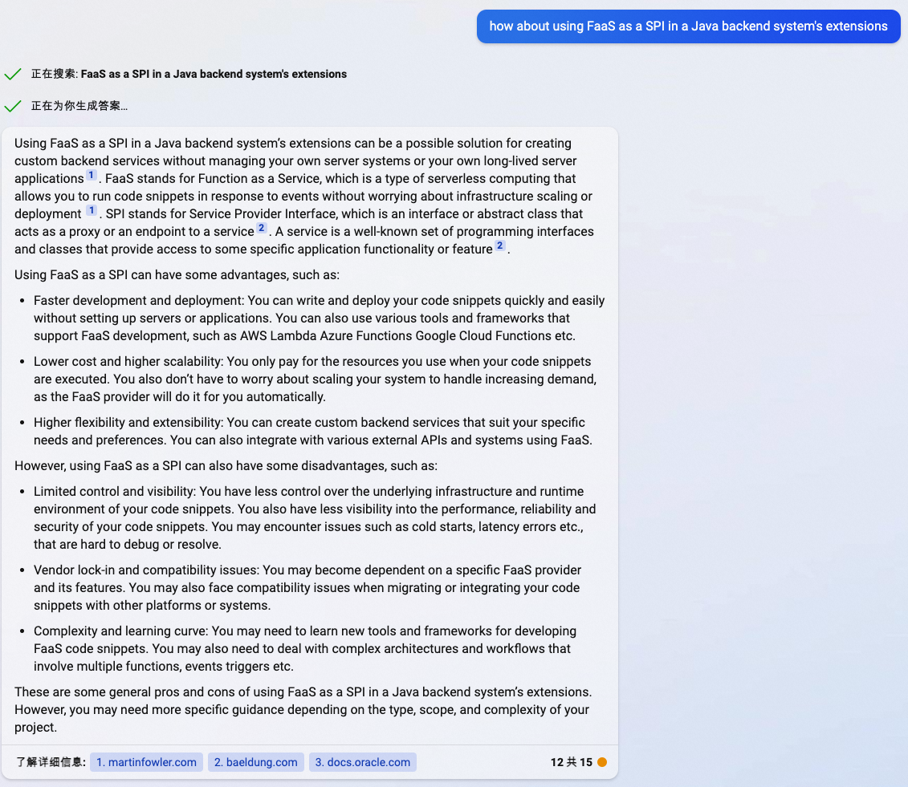
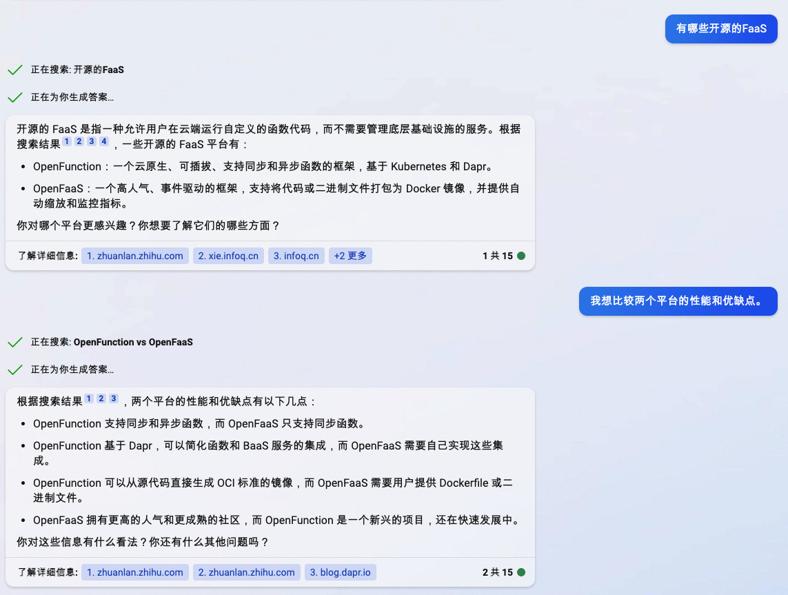

<!--more-->

最近chatGPT和openai的GPT-4大火，来试一下bing搜索引擎的ai功能

# 如何使用Bing AI聊天

首先要访问 https://bing.com/new，需要先登录微软账号，加入到waitlist就可以直接用了

界面看起来还是比价清爽的

# 专业技术问题询问

## 第一个话题BaaS

最近在研究BaaS，所以问了问啥是BaaS，BaaS有哪些

回答内容主要是一些提供服务的厂商

对于小白来说，跟着它做一些起点的调研还是够的，不过作为深度的技术人员，它回答的内容远远不够

## 第二个话题 FaaS

开始第2个话题 faas

作为基础的检索功能还是很快就提供了想要的内容，不过除了OpenFunction和OpenFaaS外，其他开源的项目并没有列举出来

所以，如果bing收了钱用来影响ai的回答结论，这个也细想想也挺可怕的
