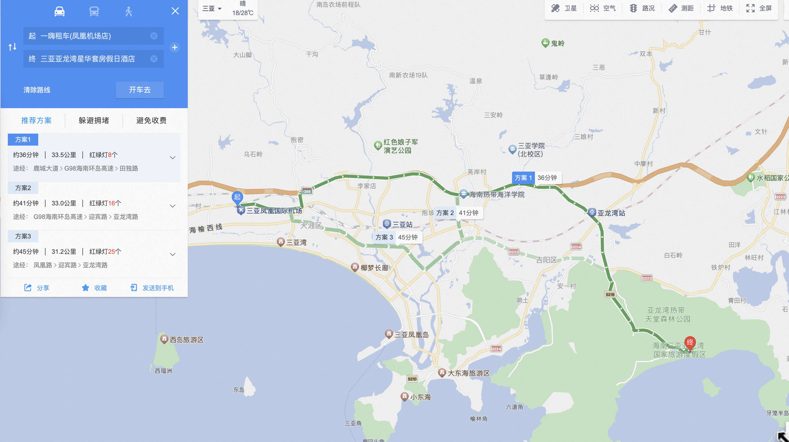
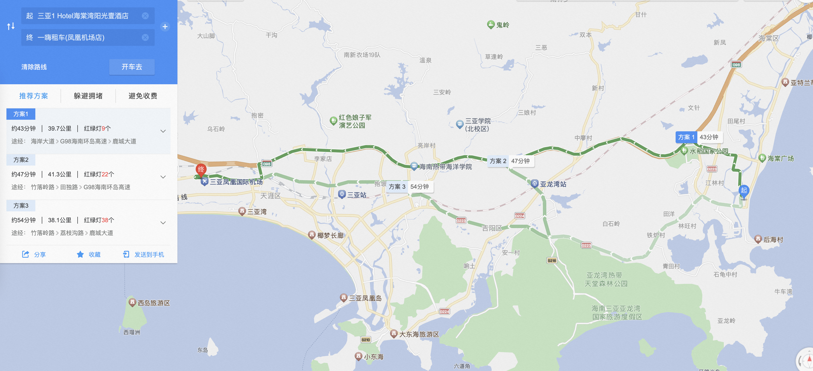
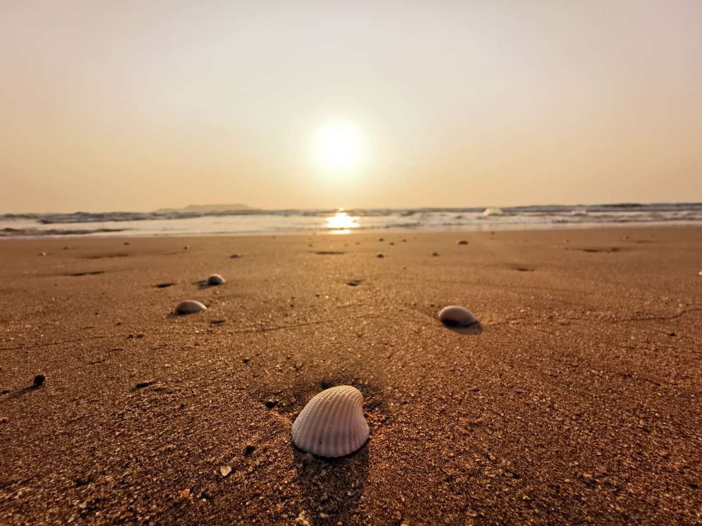
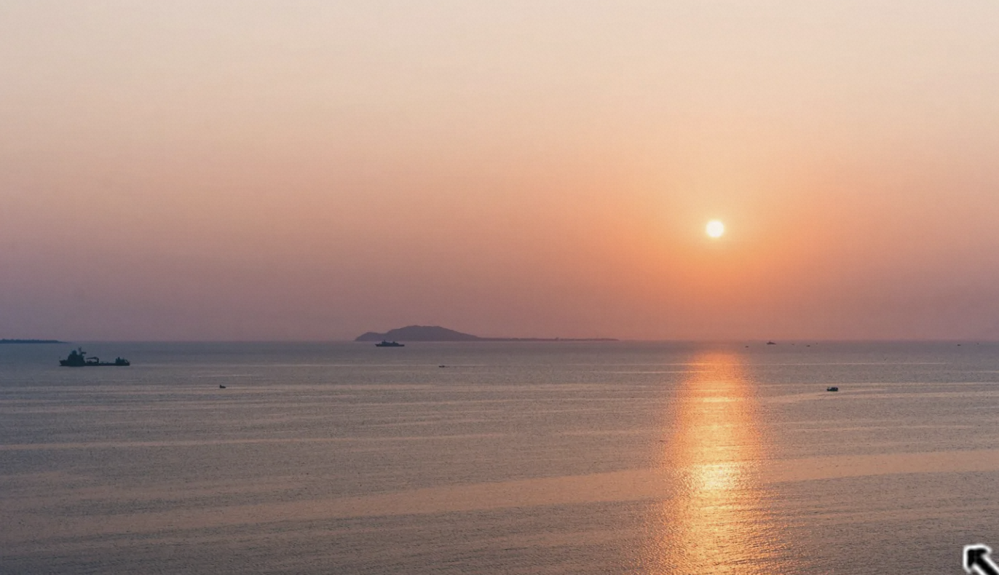
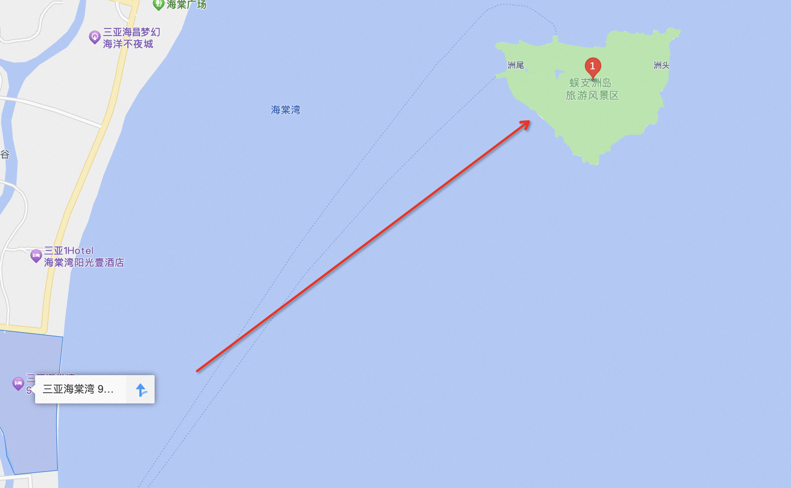
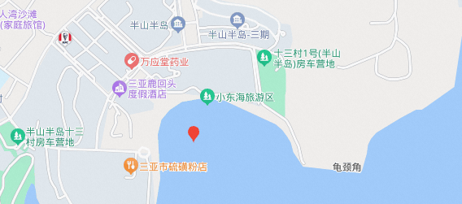
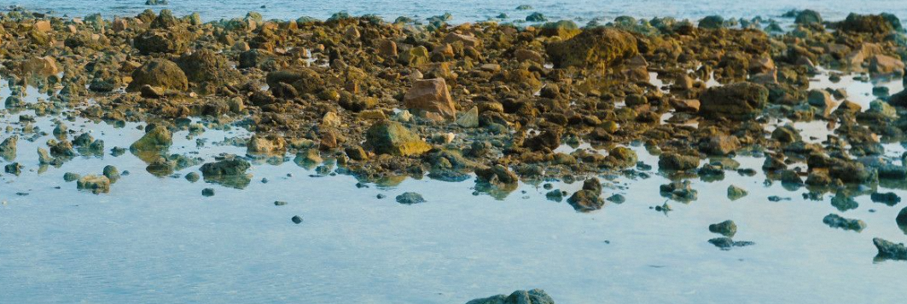

<!--more-->

# 三亚旅游攻略

## 行程

| 日期             | 时间段 | 地点                                       | 备注                    |
| ---------------- | ------ | ------------------------------------------ | ----------------------- |
| <u>**03-03**</u> | 中午   | 🛬三亚凤凰机场                              | 抵达三亚                |
|                  | 下午   | 取租车🚗 入驻亚龙湾酒店                     | 酒店玩耍                |
|                  | 晚上   | 海鲜市场吃海鲜🦈🦐🦀                          | **保持警惕 谨防被宰！** |
| <u>**03-04**</u> | 上午   | 🍜酒店早餐                                  |                         |
|                  | 中午   | 【出发】去南海观音，就近吃饭               |                         |
|                  | 下午   | 南海观音                                   |                         |
|                  | 晚上   | 椰梦长廊🌅                                  | 18点前赶到看日落        |
| **<u>03-05</u>** | 上午   | 🍜酒店早餐                                  |                         |
|                  | 中午   | 【出发】去海棠湾酒店，路上就近吃饭         |                         |
|                  | 下午   | 入住海棠湾 海棠湾酒店 沙滩玩耍🏖🏊           |                         |
|                  | 晚上   | 就近吃饭🥘                                  |                         |
| <u>**03-06**</u> | 上午   | 🍜酒店早餐，                                |                         |
|                  | 中午   | 蜈支洲岛🏝                                  |                         |
|                  | 下午   | 蜈支洲岛🏝                                  |                         |
|                  | 晚上   | 返回酒店                                   |                         |
| <u>**03-07**</u> | 上午   | 🍜酒店早餐，收拾准备返程                    |                         |
|                  | 中午   | 开车去机场，路上看看玩什么，也可以在酒店玩 |                         |
|                  | 下午   | 返还租车🚗   返程🛫                          |                         |

## 租车

租车平台对比

| 名称     | 是否押金 | 价格 | 靠谱度 |
| -------- | -------- | ---- | ------ |
| 一嗨租车 |          |      | ⭐️⭐️⭐️⭐️⭐️  |
| 神州租车 |          |      | ⭐️⭐️⭐️⭐️⭐️  |
| 携程     |          |      | ⭐️      |

一嗨租车在三亚凤凰机场的停车场里取就行，很方便，走的时候直接在机场还车就可以

## 住宿

### 亚龙湾

#### 三亚亚龙湾星华套房假日酒店

地点：三亚市吉阳区亚龙湾国家旅游度假区龙塘路14号

### 海棠湾

#### 三亚 Hotel海棠湾阳光壹酒店

地点：三亚市海棠区海棠南路4号

出门过个马路就是海边，可以赶海捡贝壳🐚 这里可以看日出

## 景点

### 椰梦长廊

看日落

### 南海观音

壮观的景象

### 亚龙湾热带天堂森林公园

### 蜈支洲岛

> 登岛时间为08:00至16:00；离岛时间为08:30至18:30
>
> 蜈支洲岛码头轮渡：上岛时间8:00-16:00；下岛时间08:30-18:30；人较多，早上排队上岛时间通常需要1小时左右

### 小东海

这里早上可以赶海，潮水褪去后 石头都露出来，可以在里面捡螃蟹和海星

### 后海村

很多冲浪在这里，但是自驾过来慎重，路很窄，很堵，要是想看日落要提前一些出发，基本7点不到就看不到日落了

### 海昌不夜城

很多小孩玩的东西，离海棠湾和免税店二期很近，有很大的摩天轮

## 吃饭

> 一天两顿饭感觉就够了，一顿酒店早餐，一顿当地特色
>
> 每天一个椰子🥥 喝起来还是很开心的

### 六盘村

一个小村改造的，很多东北人开店的地方，也有网红店，吃饭可以挑一挑再吃

### 亿恒夜市

千万不要去！！！太坑了

### 第一海鲜市场

没去过，被夜市坑了后就不想再去了

### 椰子鸡

吃了两顿椰子鸡，一顿是在酒店里赠送的，分量很大，另外一份是在大众点评上搜的排名靠前的

