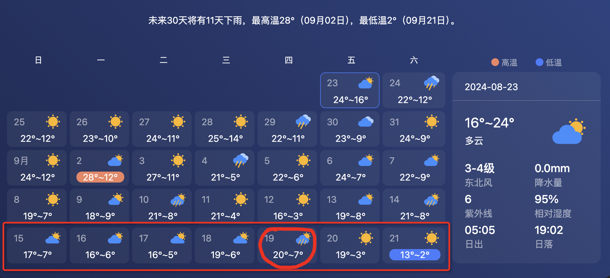

<!--more-->

# 1、行程规划

## 出发&归途

9.14-9.21 共8天，9.14 9.18-9.20请假4d

- **9.14** 出发
- **9.21** 返程

## 具体行程

| 天数 | 日期 | 出发                | 目的地                 | 住宿     | 备注       |
| ---- | ---- | ------------------- | ---------------------- | -------- | ---------- |
| D1   | 9.14 | 成都(双流机场) 4:30 | 哈尔滨(太平机场) 11:00 |          | 去程：飞机 |
| D2   | 9.15 | 哈尔滨(太平机场)    | 海拉尔东山机场         | 呼伦贝尔 | 飞机       |
| D3   | 9.16 |                     |                        |          |            |
| D4   | 9.17 |                     |                        |          |            |
| D5   | 9.18 |                     |                        |          |            |
| D6   | 9.19 |                     |                        |          |            |
| D7   | 9.20 |                     |                        |          |            |
| D8   | 9.21 | 海拉尔东山机场      | 成都                   |          | 返程       |

## 住宿酒店

| 日期 | 住宿 | 费用 |
| ---- | ---- | ---- |
|      |      |      |
|      |      |      |
|      |      |      |
|      |      |      |

# 2、出行装备List

- 必备
  - [ ] 身份证
  - [ ] 驾驶证
  - [ ] 现金
  - [ ] 口罩
- 衣服
- 电子产品
  - [ ] 办公电脑
  - [ ] 手机充电线
  - [ ] 电脑充电线
  - [ ] 充电宝
- 洗护
  - [ ] 洗面奶
  - [ ] 护肤品
  - [ ] 牙刷牙膏
  - [ ] 洗发水
  - [ ] 沐浴露
  - [ ] 香皂。洗衣液
  - [ ] 洗脸巾
  - [ ] 纸巾
  - [ ] 口罩
  - [ ] 保温杯
- 其他
  - [ ] 零食

# 3、天气情况

整体气温在19-4度左右，需要准备厚一点的衣服

# 4、租车

| 分类   | 费用   | 备注         |
| ------ | ------ | ------------ |
| 租车   | ￥2084 | SUV 大众探岳 |
| 燃油费 |        |              |
| 过路费 |        |              |

# 5、旅游预算

| 项目        | 预算金额 | 备注 |
| ----------- | -------- | ---- |
| 机票        |          |      |
| 住宿费用    |          |      |
| 租车费用    |          |      |
| 经典门票    |          |      |
| 油费+过路费 |          |      |
| 伙食费      |          |      |

