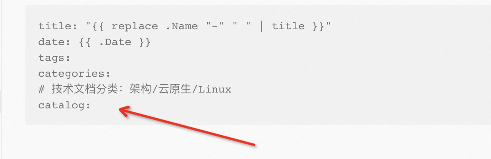
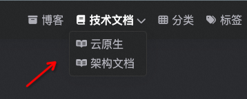

<!--more-->
> Tips：
>
> 本站点针对技术文档做过调整，写作方式只针对本博客

# Hugo初始化搭建

官网：https://gohugo.io/

## 安装Hugo

安装方式有如下两种：

- 使用brew工具安装（国内镜像源一般都不是最新版本，有些新的主题无法使用）

```
brew install hugo
```

- 直接下载release文件绑定到PATH上

最新的release包可以在[Hugo releases](https://github.com/gohugoio/hugo/releases)拿到 


## 安装Theme

```
git submodule add https://github.com/AtticusLv/FixIt themes/FixIt
```

升级主题
```
git submodule update --remote --merge themes/FixIt
```

## 本地调试

```
hugo server
```

编译静态文件，生成目录为/public

```
hugo
```


# 创建日常博客

- 只文字版

```
hugo new posts/xxx.md
```

- 图文版

```
hugo new posts/xxx/index.md
```

使用typora编辑时，会自动在posts/xxx/目录下增加相关图片目录

# 创建技术文档

- 只文字版

```
hugo new tech/[catalog]/xxx.md
```

- 图文版

```
hugo new tech/[catalog]/xxx/index.md
```

例如，要创建一个技术文档，并且包换图片，catalog为「云原生」，那运行的命令为

```
hugo new tech/cloudnative/istio_proxy/index.md
```

在index.md文件中修改title、catalog，然后直接deploy到github上就完成发布了

## 增加catalog分类

在```layouts/tech/tech.html```模板中，增加了下面的代码，可以根据文章中 **catalog** 字段来分类，这样让技术文章就具备层级结构了

```
  tech.html中内容
  .....
  <!-- 显示所有tech下的文档 -->
  {{- $curpages := where .Site.Pages "Type" "tech" -}}
  <!-- 根据catalog字段内容分类 -->
  {{- $pages := $curpages.GroupByParam "catalog" -}}
  .....
```

在tech目录下new出来的文章，会根据tech的模板，自动加上catalog字段



## 如何在1级标题栏【技术文档】增加2级目录



以【cloudnative】举例

1. 在tech下创建目录/tech/cloudnative
2. /tech/cloudnative下创建 ```_index.md``` 文件，可以手动创建，也可以用命令行创建，内容如下：

```
---
title: "云原生目录"
layout: cloudnative
hidden: true
type: cloudnative
summary: 历史文章按照年月归档.
url: /tech/cloudnative
menu:
  main:
    title: 架构文档
    parent: tech
    weight: 0
    params:
      icon: fa-brands fa-readme
catalog: 云原生
---
```

需要注意catalog、layout和type字段，其中menu是用来在1级标题栏下增加2级标题栏的主要代码，weight控制2级目录显示顺序，越大越靠上，越小越靠下

3. 在layouts下创建目录/tech/cloudnative，创建文件```cloudnative.html```，内容可以从posts模板或者其他地方模板下复制过来，内容略


# 更新Theme样式

站点样式采用 [**FixIt**](https://github.com/hugo-fixit/FixIt)，因为有部分样式要调整，已fork到 ```https://github.com/AtticusLv/FixIt```

```git
git submodule update --remote --merge
```


# 使用bash一键提交

编辑bash脚本```./deploy.sh```一键提交git

```
./deploy.sh "[commit content]"
```

脚本内容如下：

```
#!/bin/bash
# date time
currentDateTime=`date '+%Y-%m-%d %H:%M:%S'`
commitMsg=$currentDateTime" "$1

echo "提交commit: "${commitMsg}

git add .
git commit -m "${commitMsg}"
git pull
git status

echo "git add/commit/pull done..."
# push to remote main branch
git push -u origin main
```

**注意**：使用前需要给脚本添加权限

```
chmod 755 deploy.sh
```


# 特别注意

## 无图片文章转换为有图片文章

**因为hugo结构的原因，如果要将没有图片的文章转换为有图片的文章，需要单独创建一个目录，将原理的.md文件移入，并且重命名为index.md**


# 剩余未完成工作

- [ ] 代码块行数和复制功能
