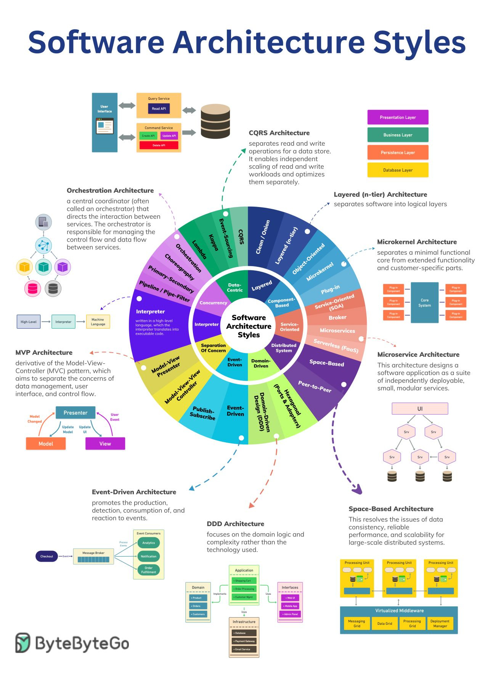

> 原文：[https://blog.bytebytego.com/p/ep68-top-architectural-styles?ref=dailydev](https://blog.bytebytego.com/p/ep68-top-architectural-styles?ref=dailydev)

- CQRS
- Layered(n-tier)
- Mirokernel
- Microservices
- Space-Based
- DDD
- Event-Driven
- MVP
- Orchestration