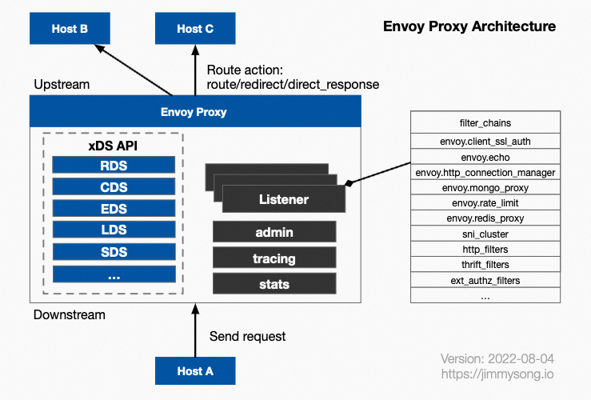
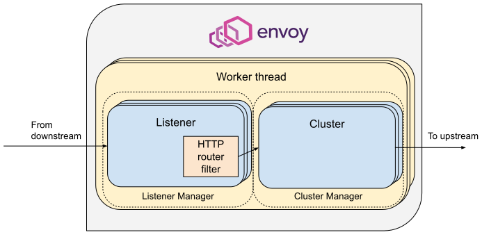

> Envoy是service mesh中常用的数据面板（data plane），用来流量劫持和转发的。istio（一种控制面板的实现方式）中常是用envoy来作为sidecar，istio在envoy的xDS协议上做了很多扩展逻辑，流量劫持背后主要通过iptables技术将出入pod流量都劫持到sidecar上，这里主要参考Jimmy Song大佬的博客，深挖下enovy的基本原理和相关配置，收集整理了下相关资料

## Envoy

转一张envoy的架构图(转自[jimmysong.io](jimmysong.io))



### 一些术语

- Downstream

  下游服务，指连接到envoy的服务，这些服务发送请求到envoy，并接收envoy响应

- Upstream

  上游服务，指接收envoy连接和请求的服务，并将响应返回给envoy

- Listener

  监听器，envoy暴露一个活多个listener来监听downstream的请求；当listener监听到请求时，会交给filter chains处理

- Cluster

  envoyy连接的一组逻辑相同的upstream服务；envoy通过service discovery来发现cluster成员，通过load balance将流量路由到cluster的各个成员去

- xDS

  xDS中的x是一个代词，x指一系列的，DS=Discovery Service发现服务，目前是envoy作为数据面板的api实现规范，可以在[envoy api](https://github.com/envoyproxy/envoy/tree/main/api)中看到具体实现，[xDS REST and gRPC protocol文档](https://www.envoyproxy.io/docs/envoy/latest/api-docs/xds_protocol)

  xDS包括：

  - LDS: listener discovery service
  - RDS: route discovery service
  - SRDS: scoped route discovery service
  - VHDS: virtual host discovery service
  - CDS: cluster discovery service
  - EDS: endpoint discovery service
  - SDS: secret discovery service
  - RTDS: runtime discovery service
  - ADS: aggregated discovery service, 这是个特殊的，是对其他的一种聚合统一封装

  

### 关于xDS版本

​	xDS在envoy和mesh架构中是一个很重要的概念，也是选址规则的核心逻辑。目前envoy的xDS协议有v1和v2版本，在isito1.0+版本中只支持v2版本的xDS API了，目前istio官网的bookinfo示例中也是指定了```--v2-config-only``` ，需要注意的是v2版本并不直接向下兼容v1版本。envoy不同版本对v1和v2版本的支持。

​	关于xDS，CNCF已经开源出来了，也是主流的数据面板的api规范，感兴趣可以到[cncf/xds](https://github.com/cncf/xds)查看下，最新官网已经出了v3的版本，仍在开发中。v2版本是当前的稳定版本。


### istio和envoy关系


​	envoy与业务服务部署在同一个pod中，共享网络和namespace，envoy通过iptables技术劫持业务服务的进出流量，按照istio下发的流量规则去路由流量。其中envoy的容器中部署了istio的探针——pilot-agent，在启动时istio会为envoy注入bootstrap配置，其余和动态的配置会通过pilot下发。

​	在整个数据平面中，各个envoy的动态配置应该是相同的，可以通过```istioctl ps```命令查看各个sidecar的配置是否同步

​	运行时，可以在sidecar容器内通过命令行查看envoy proxy配置是否同步

```
curl http://localhost:15000/config_dump
```

​	也可以通过kubectl命令将文件dump下来

```
kubectl -n default exec ratings-v1-7c9949d479-dwkr4 -c istio-proxy curl http://localhost:15000/config_dump > dump-rating.json
```

​	这里用到了envoy的admin接口，详细的admin接口介绍可以在envoy文档中看到

#### istio+envoy启动过程


### envoy proxy配置解析

​	istio部署的istio-proxy(即envoy sidecar，部署时名字命名为istio-proxy)，包含以下几个部分：

- **bootstrap**: envoy启动时加载的静态配置

- **listeners**: 监听器配置，通过LDS下发

- **clusters**: 集群配置，静态配置中包括xds-grpc和zipkin地址，动态配置使用CDS下发

  cluster分为inbound和outbound，inbound对应envoy所在pod上的服务，outbound占了大多数，对应envoy所在pod以外的服务

- **routes**: 路由配置，静态配置中包括了本地监听的服务集群信息，引用了cluster，动态配置使用RDS下发

每个部分都包括静态配置和动态配置，其中bootstrap配置是在集群启动时通过istio-proxy的启动参数注入的，配置文件在``` /etc/istio/proxy/envoy-rev0.json``` 

以官方bookinfo工程示例，可以看到下面的配置


如果部署了kiali，也可以在workload的面板中看到envoy的各个配置信息


#### boostrap


#### 服务发现类型

cluster 的服务发现类型主要有：

- **ORIGINAL_DST**：类型的 Cluster，Envoy 在转发请求时会直接采用 downstream 请求中的原始目的地 IP 地址
- **EDS**：EDS 获取到该 Cluster 中所有可用的 Endpoint，并根据负载均衡算法（缺省为 Round Robin）将 Downstream 发来的请求发送到不同的 Endpoint。**istio 会自动为集群中的 service 创建代理信息，listener 的信息从 service 获取，对应的 cluster 被标记为 EDS 类型**
- **STATIC**：缺省值，在集群中列出所有可代理的主机 Endpoints。当没有内容为空时，不进行转发。
- **LOGICAL_DNS**：Envoy 使用 DNS 添加主机，但如果 DNS 不再返回时，也不会丢弃。
- **STRICT_DNS**：Envoy 将监控 DNS，而每个匹配的 A 记录都将被认为是有效的。


#### 两个特殊的cluster

- **BlackHoleCluster**

  匹配到BlackHoleCluster的流量不会被转发

```
{
    "name": "BlackHoleCluster",
    "type": "STATIC",
    "connectTimeout": "10s"
}
```


- **PassthroughtCluster**

  匹配到PassthroughCluster的流量数据包的目的ip不会改变

```
{
    "name": "PassthroughCluster",
    "type": "ORIGINAL_DST",
    "connectTimeout": "10s",
    "lbPolicy": "CLUSTER_PROVIDED",
    "circuitBreakers": {
       "thresholds": [
          {
              "maxConnections": 4294967295,
               "maxPendingRequests": 4294967295,
               "maxRequests": 4294967295,
               "maxRetries": 4294967295
            }
        ]
 }
```

类型为```ORIGINAL_DST``` 流量将原样转发

#### 特殊listener

envoy有一个特殊的listener——virtualOutbound

- virtualOutbound：每个envoy都有一个绑定到```0.0.0.0:15001```的listener，下面挂关联了许多virtual listener。

iptables会先将所有出站流量导入该listener，其中有个字段```useOriginalDst```设置为```true```，表示会使用最佳匹配原始目的地的方式，将请求分发到和请求原目的地址关联的virtual listener处理；

如果没有找到任何的virtual listener，则根据istio的```outboundTrafficPolicy```全局配置选项进行处理，这里会有2种情况

- outboundTrafficPolicy: **ALLOW_ANY**: 网格允许法相任何外部服务的请求，不管改服务是否在pilot的服务注册表中，在这个策略下，pilot会在下发给envoy的VirtualOutbound Listener加入一个upstream cluster为PassthroughCluster的TCP proxy filter，找不到匹配端口的listener请求会被该TCP proxy filter处理，请求将会被发送到其IP头中的原始目的地址

- outboundTrafficPolicy: **REGISTRY_ONLY**: 只允许法相Pilot服务注册表中存在的服务对外请求。这种策略下，Pilot将会再下发给Envoy的VirtualOutbound Listener加入一个upstream cluster位BlackHoleCluster的TCP proxy filter，找不到匹配端口listener的请求会被该TCP proxy filter处理，由于BlackHoleCluster中没有配置upstream host，请求实际上会被丢弃


### 一次请求在Envoy中经过了什么

在官网[Life of a Request](https://www.envoyproxy.io/docs/envoy/latest/intro/life_of_a_request)章节中有详细描述：envoy可以简化为**Listener**和**Cluster**两个部分构成

- Listener：处理downstream请求，将响应体返回给downstream
- Cluster：处理到upstream连接和请求，将请求直接发送到endpoint，其中包括cluster注册表、负载均衡、健康检查、连接池等



envoy是事件驱动模型，一进程多线程的方式，主线程主要处理envoy自身的生命周期、配置、监控等，每个请求都有独立的worker线程来处理的。每个work线程维护着到upstream各个endpoint的TCP连接池


### Bookinfo示例调用过程


## 参考资料

https://www.envoyproxy.io/docs/envoy/latest/intro/arch_overview/arch_overview

https://jimmysong.io/blog/envoy-proxy-config-deep-dive/

https://jimmysong.io/blog/envoy-sidecar-injection-in-istio-service-mesh-deep-dive/

https://cloud.tencent.com/developer/article/1552334

https://blog.csdn.net/qq_20365437/article/details/107702413

https://academy.tetrate.io/courses/envoy-fundamentals

