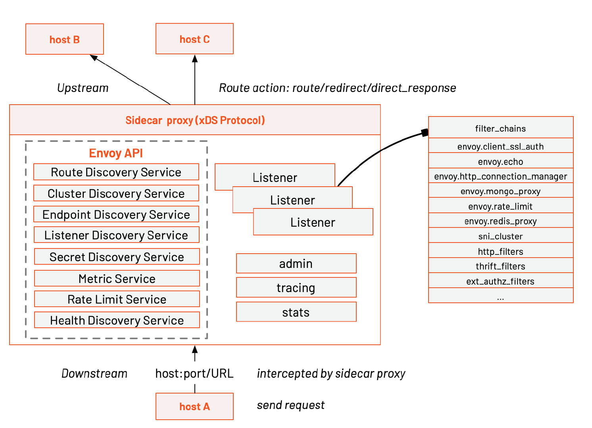

# Envoy资料


## 官方资料

https://www.envoyproxy.io/


## Envoy架构

https://jimmysong.io/blog/envoy-archiecture-and-terminology/



## Envoy教程

- 使用Envoy反向代理教程 https://www.tetrate.io/blog/get-started-with-envoy-in-5-minutes/

https://academy.tetrate.io/courses/envoy-fundamentals-zh  中文

- Envoy 基础教程：入门篇

​		https://icloudnative.io/posts/run-envoy-on-your-laptop/

​		https://www.envoyproxy.io/docs/envoy/latest/start/sandboxes/front_proxy.html

- 视频&实验室教程

  https://academy.tetrate.io/courses/envoy-fundamentals-zh

- 中文文档

  https://icloudnative.io/envoy-handbook/docs/overview/overview/

- 


## 原理


### [理解 Istio Service Mesh 中 Envoy 代理 Sidecar 注入及流量劫持](https://jimmysong.io/blog/envoy-sidecar-injection-in-istio-service-mesh-deep-dive/)


### Filter

#### Listener Filter


#### Network Filter


#### Http Filter


## 配置

config dump

```
curl localhost:15000/config_dump
```


## 相关文章

Using Envoy to route internal requests https://blog.asana.com/2021/08/route-internal-requests-services-envoy/#close


- [Istio EnvoyFilter+Lua 简单实现动态路由转发](https://blog.csdn.net/MichaelJScofield/article/details/126948885)


- [Envoy Http请求原理解析](https://cloud.tencent.com/developer/article/1475931)


