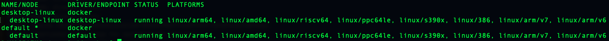

在构建docker镜像时遇到

```
 => ERROR [internal] load metadata for docker.io/library/openjdk:8u252-jdk-slim   
```

直接在mac上拉取镜像发现拉不到，换了一个平台架构发现镜像是存在的

```
docker pull openjdk:8u252-jdk-slim --platform linux/x86_64
# 拉取镜像的过程
8u252-jdk-slim: Pulling from library/openjdk
8559a31e96f4: Already exists 
65306eca6b8e: Already exists 
b8f37a6e9e9b: Already exists 
33231475bae0: Already exists 
Digest: sha256:3826479f6ca03bbd11e1e12eb78b856f90bf7cea0f534f7204854c82fd89eda2
Status: Downloaded newer image for openjdk:8u252-jdk-slim
docker.io/library/openjdk:8u252-jdk-slim

```

最新的 Docker Desktop for Mac M1 版本，已经为我们集成了一个实验性的工具**buildx**，通过它，可以编译成各种不同平台架构下的镜像，**buildx**目前支持的平台架构可以通过命令 `docker buildx ls` 来查看




可以使用下面的命令构建出符合当前机器架构的镜像版本

```
docker buildx build --platform=linux/amd64 . [container name]
```


加tag的方式

```
 docker buildx build --platform=linux/amd64 -t keruyun-registry.cn-hangzhou.cr.aliyuncs.com/keruyun/keruyun-sidecar-agent:r154 .
```

