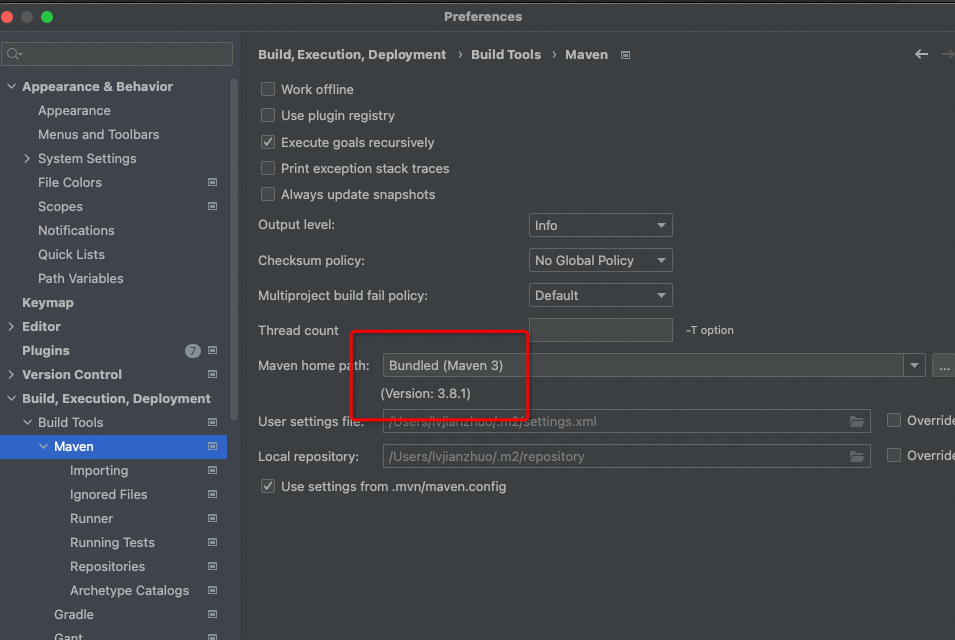
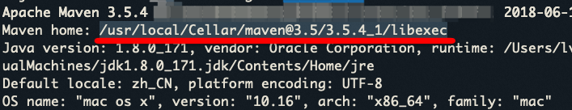
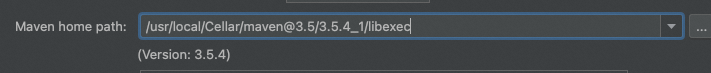

## 问题

更新了idea intellij到最新版本后，无法拉到jar source源码，显示


这样就看不到jar的源码了，排查问题很痛苦

## 原因

本地的maven版本和idea默认的版本（新版本是3.8.1）不一致，导致无法拉取到source jar包


一般是idea默认的maven版本太高了




## 解决方法

### 1. 将idea的maven版本配置成和本地一样的版本

查看本地的maven版本

```
mvn -version
```





将maven路径直接拷贝到idea maven的配置里



此时idea会直接显示出maven路径的版本，如果没有显示，说明配置地址不对


### 2. 将本地的maven升级到和idea版本一致

这种要重新去下载对应版本的maven，本地PATH重新绑定


> 注意：对于一些老工程已经依赖了旧版本的maven，只能保持maven和工程里版本一致


### 3. maven wrapper

使用maven wrapper，其实就是工程里将maven的包放置进来，直接使用工程里的maven版本


## 参考

https://stackoverflow.com/questions/70214833/intellij-2021-3-maven-not-able-to-resolve-dependencies-after-update-to-intellij