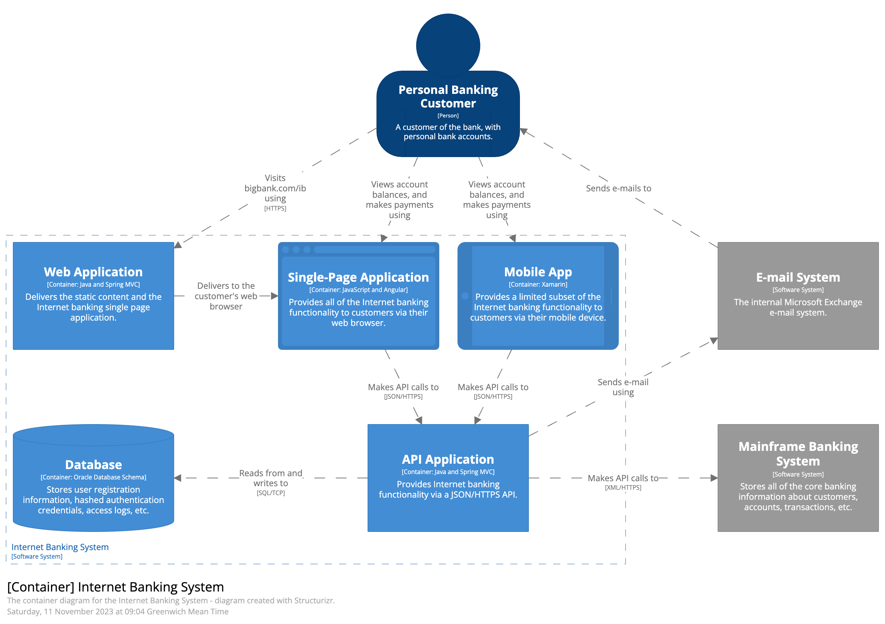
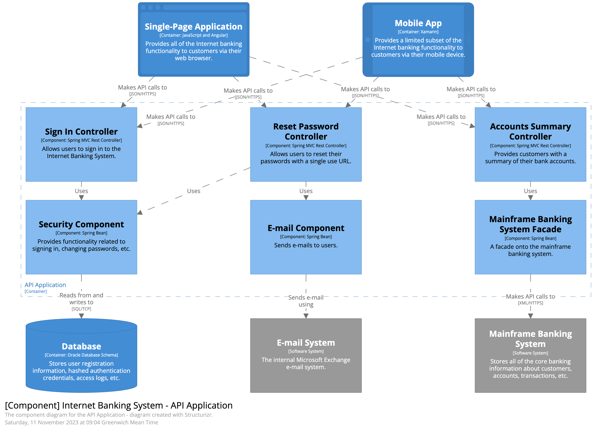

# C4 Model

### **概述**



C4 Model是一种架构设计的方法(划重点：**画图吹逼**)，C4 代表上下文（Context）、容器（Container）、组件（Component）和代码（Code）——一系列分层的图表，可以用这些图表来描述不同缩放级别的软件架构，每种图表都适用于不同的受众。要为你的代码创建框架图，首先需要一组通用的抽象来创建一种无处不在的语言，用来描述软件系统的静态结构。C4 模型使用容器（应用程序、数据存储、微服务等）、组件和代码来描述一个软件系统的静态结构。同时它还考虑到使用软件系统的不同人能够理解。

C4非常的简单好入手，对于复杂/简单的软件系统设计都提供了一种简明、好上手、易理解的架构思路，尤其是对于快速迭代的小团队来说非常好用，没有那么多废话和繁文缛节，感兴趣同学可以去看看原文：

源网站：https://c4model.com/

中文版：https://www.infoq.cn/article/C4-architecture-model/



### **1、系统上下文（System Context）**



系统上下文(System Context)是构建一个软件系统的开始，例如上面的“互联网银行系统”示例，先画一个中心思想在最终解，然后周围画上使用系统的用户和其他相关交互的系统。这里并不需要体现详细实现内容，而是展示整体软件的全貌蓝图，也可以说是把业务用例详细的展示出来。



### **2、容器（Container Diagram）**



在完成系统上下文后，系统大概需要的功能都清楚了，接下来就是“Container”详细绘制环节了。这里的容器Container的含义不是指Kubernetes虚拟化容器那些哈，而是类似单页服务、API、数据库、三方服务等等，指能够独立部署运行的系统单元。

Container能够展示出大致的软件架构了，各个分布系统的组成，而且有一些技术选型在这里已经能初步看到了（比方上面的SPA、Mobile App），大致哪些会自建，哪些去直接使用现成的SaaS或PaaS服务。



### **3、组件（Component Diagram）**



深入某一个Container的内容，Container由一个个Component构成，这里可以轻微借鉴下DDD思想，高内聚低耦合的各个组件模块设计出来，包括功能、边界、系统中所处位置（比如说简单的Controller-Service-DAO的这种分层结构）



### **4、代码（Code Diagram）**



最后，就是深入到各个Component组件中，去设计详细的代码结构了，就拿java举例，包括包、类、类关系、异常处理、字段、方法等等，这里甚至除了用PlantUML建模工具外，也可以直接用IDE来设置产出（Idea Intellij中就有很多类图插件可以直接产出）。

### **结束语**

C4Model网站中提供了大量的案例，而且网站给出的架构思路相对比较严谨，对于初学者还有多年开发者学习和思考上非常有帮助，希望能在大家工作中帮助到大家。



---

> 作者: 大卓  
> URL: https://nuoyang.tech/tech/architecture/c4model/  

