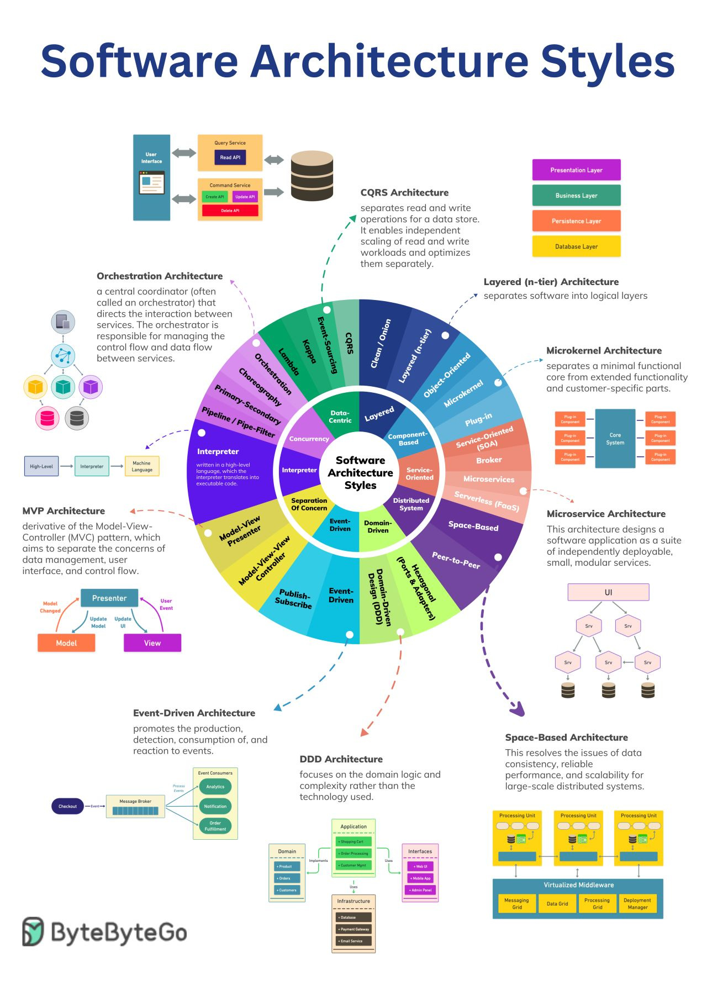

# 几种常见的软件架构

&gt; 原文：[https://blog.bytebytego.com/p/ep68-top-architectural-styles?ref=dailydev](https://blog.bytebytego.com/p/ep68-top-architectural-styles?ref=dailydev)

- CQRS
- Layered(n-tier)
- Mirokernel
- Microservices
- Space-Based
- DDD
- Event-Driven
- MVP
- Orchestration

---

> 作者: 大卓  
> URL: https://nuoyang.tech/tech/architecture/software_architecture_styles/  

