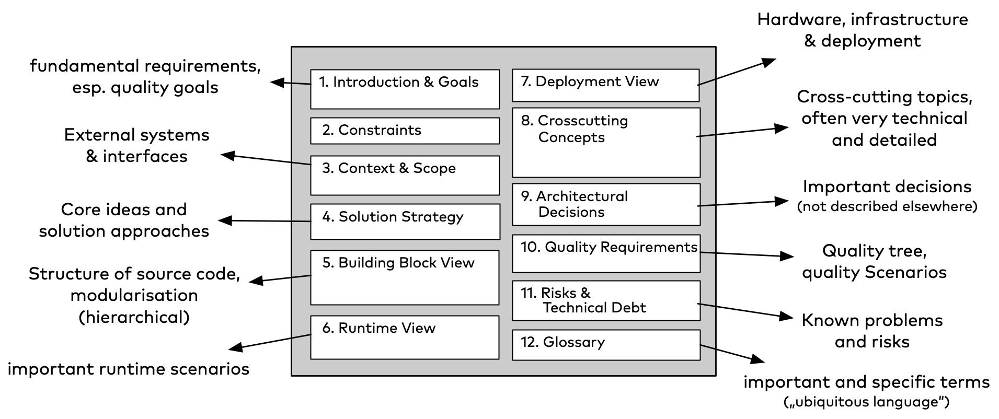
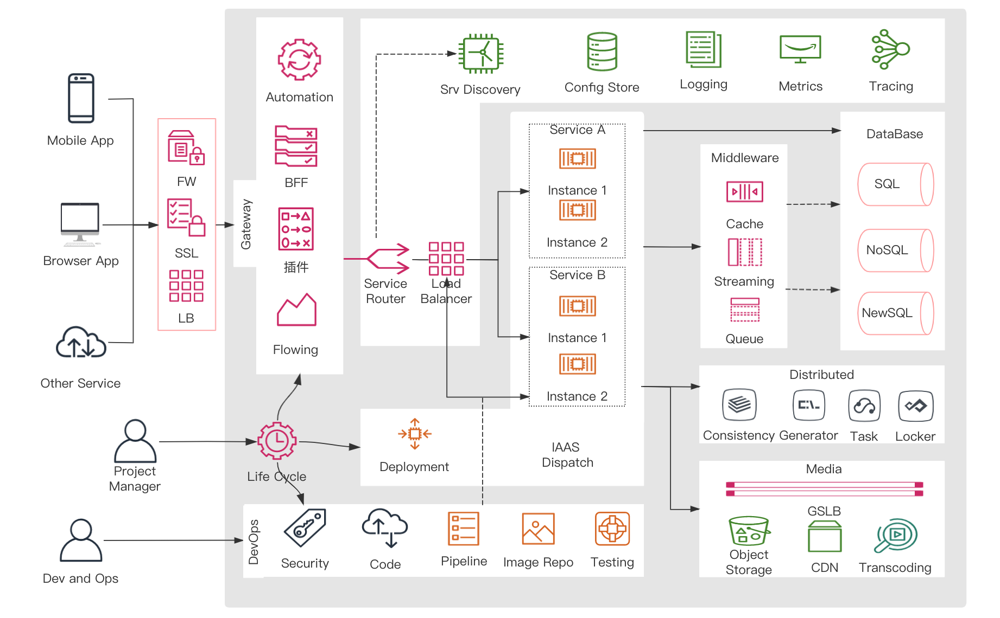

# System Architecture Collection

# System Architecture Collection

## Theories

### TOGAF

https://pubs.opengroup.org/architecture/togaf9-doc/arch/

### 如何构建大型分布式系统

https://icyfenix.cn/

### Modular Monolith System

https://www.kamilgrzybek.com/

### Multi-Runtime Microservices Architecture

&gt; mecha架构

https://www.infoq.com/articles/multi-runtime-microservice-architecture/

## 架构模板

- arc42 https://arc42.org/overview

## Common System Solutions

## Reference

- Open Group Library https://publications.opengroup.org/

  provide standards, guides, webinars, white papers about IT architecture and system design.

- 《架构师图谱》https://blog.xstudio.mobi/a/230.html

- 

---

> 作者: 大卓  
> URL: https://nuoyang.tech/tech/architecture/system_architecture/  

