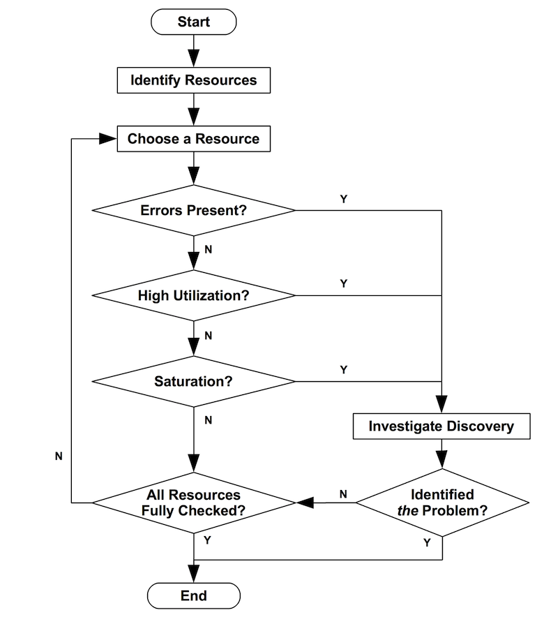

# USE方法定位Linux性能问题

## USE方法定位性能问题

https://www.brendangregg.com/usemethod.html

实践

https://blog.mygraphql.com/zh/posts/low-tec/network/tcp-flow-control-part1/

---

> 作者: 大卓  
> URL: https://nuoyang.tech/tech/architecture/use_method/  

