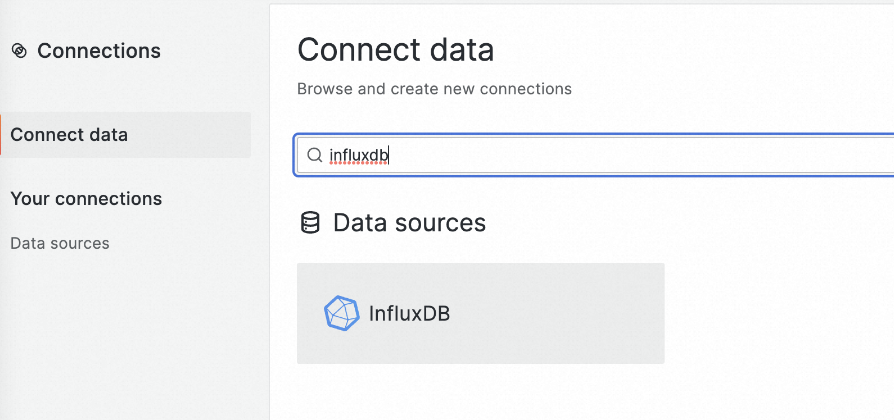
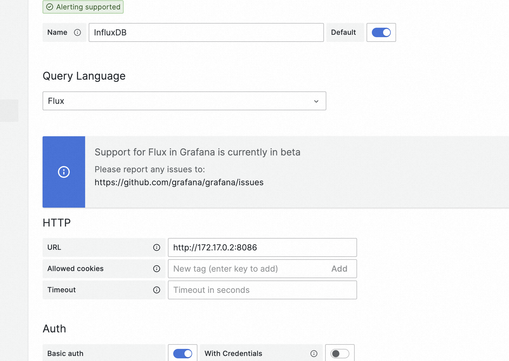
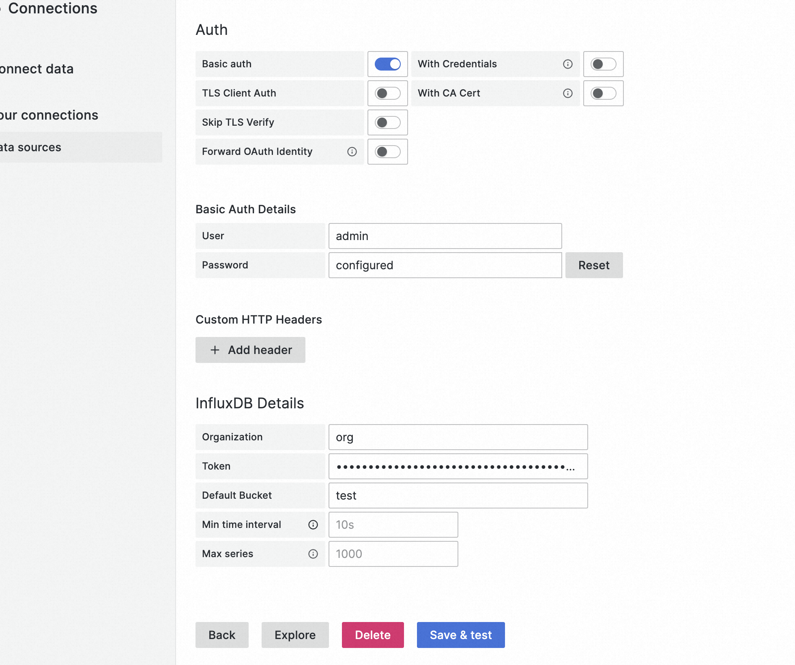
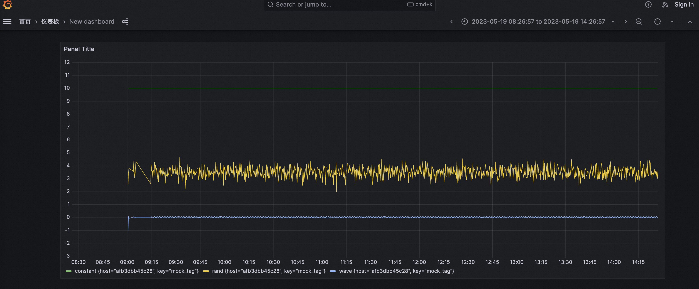

# 使用InfluxDB、Telegraf和Grafana采集和展示时序数据


&gt; 参考
&gt;
&gt; https://zhuanlan.zhihu.com/p/444649783


## 安装InfluxDB和Telegraf

### 1. 获取InfluxDB和telegraf image

```
docker pull influxdb
```


```
docker pull telegraf
```


### 2. 运行InfluxDB

在运行InfluxDB之前，先在本地创建一个目录，方便去备份InfluxDB的存储

```
docker run -d --name influxdb -p 8086:8086 --volume $PWD:/root/.influxdbv2 influxdb
```

通过$PWD命令绑定host宿主机目录


### 3. 运行telegraf

直接运行telegraf会提示缺少config，可以先运行起来，后面创建了telegraf配置再配置telegraf.config文件

```
docker run -d --name=telegraf -P telegraf
```

报错信息如下

```
2023-05-17T05:59:52Z I! Loading config: /etc/telegraf/telegraf.conf
2023-05-17T05:59:52Z E! [telegraf] Error running agent: no outputs found, did you provide a valid config file?
```


### 4. 打开InfluxDB

访问 [http://localhost:8086](http://localhost:8086)


第一次登录的时候会提示配置用户名、密码、组织等信息，并且会生成一个api token


### 5. 配置telegraf

可以在宿主机上创建telegraf目录，将telegraf.conf配置文件绑定到容器指定volume上，容器上目录地址

```
/etc/telegraf
```

telegraf.conf配置可以从influxdb的telegraf页面中获取到，也可以自己增加，下面是个配置参考，需要将url和token换成实际influxdb的值

```
# Configuration for telegraf agent
[agent]
  ## Default data collection interval for all inputs
  interval = &#34;1s&#34;
  ## Rounds collection interval to &#39;interval&#39;
  ## ie, if interval=&#34;10s&#34; then always collect on :00, :10, :20, etc.
  round_interval = true

  ## Telegraf will send metrics to outputs in batches of at most
  ## metric_batch_size metrics.
  ## This controls the size of writes that Telegraf sends to output plugins.
  metric_batch_size = 1000

  ## Maximum number of unwritten metrics per output.  Increasing this value
  ## allows for longer periods of output downtime without dropping metrics at the
  ## cost of higher maximum memory usage.
  metric_buffer_limit = 10000

  ## Collection jitter is used to jitter the collection by a random amount.
  ## Each plugin will sleep for a random time within jitter before collecting.
  ## This can be used to avoid many plugins querying things like sysfs at the
  ## same time, which can have a measurable effect on the system.
  collection_jitter = &#34;0s&#34;

  ## Default flushing interval for all outputs. Maximum flush_interval will be
  ## flush_interval &#43; flush_jitter
  flush_interval = &#34;10s&#34;
  ## Jitter the flush interval by a random amount. This is primarily to avoid
  ## large write spikes for users running a large number of telegraf instances.
  ## ie, a jitter of 5s and interval 10s means flushes will happen every 10-15s
  flush_jitter = &#34;0s&#34;

  ## By default or when set to &#34;0s&#34;, precision will be set to the same
  ## timestamp order as the collection interval, with the maximum being 1s.
  ##   ie, when interval = &#34;10s&#34;, precision will be &#34;1s&#34;
  ##       when interval = &#34;250ms&#34;, precision will be &#34;1ms&#34;
  ## Precision will NOT be used for service inputs. It is up to each individual
  ## service input to set the timestamp at the appropriate precision.
  ## Valid time units are &#34;ns&#34;, &#34;us&#34; (or &#34;µs&#34;), &#34;ms&#34;, &#34;s&#34;.
  precision = &#34;&#34;

  ## Log at debug level.
  # debug = false
  ## Log only error level messages.
  # quiet = false

  ## Log target controls the destination for logs and can be one of &#34;file&#34;,
  ## &#34;stderr&#34; or, on Windows, &#34;eventlog&#34;.  When set to &#34;file&#34;, the output file
  ## is determined by the &#34;logfile&#34; setting.
  # logtarget = &#34;file&#34;

  ## Name of the file to be logged to when using the &#34;file&#34; logtarget.  If set to
  ## the empty string then logs are written to stderr.
  # logfile = &#34;&#34;

  ## The logfile will be rotated after the time interval specified.  When set
  ## to 0 no time based rotation is performed.  Logs are rotated only when
  ## written to, if there is no log activity rotation may be delayed.
  # logfile_rotation_interval = &#34;0d&#34;

  ## The logfile will be rotated when it becomes larger than the specified
  ## size.  When set to 0 no size based rotation is performed.
  # logfile_rotation_max_size = &#34;0MB&#34;

  ## Maximum number of rotated archives to keep, any older logs are deleted.
  ## If set to -1, no archives are removed.
  # logfile_rotation_max_archives = 5

  ## Pick a timezone to use when logging or type &#39;local&#39; for local time.
  ## Example: America/Chicago
  # log_with_timezone = &#34;&#34;

  ## Override default hostname, if empty use os.Hostname()
  hostname = &#34;&#34;
  ## If set to true, do no set the &#34;host&#34; tag in the telegraf agent.
  omit_hostname = false
[[outputs.influxdb_v2]]
  ## The URLs of the InfluxDB cluster nodes.
  ##
  ## Multiple URLs can be specified for a single cluster, only ONE of the
  ## urls will be written to each interval.
  ##   ex: urls = [&#34;https://us-west-2-1.aws.cloud2.influxdata.com&#34;]
  urls = [&#34;http://localhost:8086&#34;]

  ## Token for authentication.
  token = &#34;$INFLUX_TOKEN&#34;

  ## Organization is the name of the organization you wish to write to; must exist.
  organization = &#34;org&#34;

  ## Destination bucket to write into.
  bucket = &#34;test&#34;

  ## The value of this tag will be used to determine the bucket.  If this
  ## tag is not set the &#39;bucket&#39; option is used as the default.
  # bucket_tag = &#34;&#34;

  ## If true, the bucket tag will not be added to the metric.
  # exclude_bucket_tag = false

  ## Timeout for HTTP messages.
  # timeout = &#34;5s&#34;

  ## Additional HTTP headers
  # http_headers = {&#34;X-Special-Header&#34; = &#34;Special-Value&#34;}

  ## HTTP Proxy override, if unset values the standard proxy environment
  ## variables are consulted to determine which proxy, if any, should be used.
  # http_proxy = &#34;http://corporate.proxy:3128&#34;

  ## HTTP User-Agent
  # user_agent = &#34;telegraf&#34;

  ## Content-Encoding for write request body, can be set to &#34;gzip&#34; to
  ## compress body or &#34;identity&#34; to apply no encoding.
  # content_encoding = &#34;gzip&#34;

  ## Enable or disable uint support for writing uints influxdb 2.0.
  # influx_uint_support = false

  ## Optional TLS Config for use on HTTP connections.
  # tls_ca = &#34;/etc/telegraf/ca.pem&#34;
  # tls_cert = &#34;/etc/telegraf/cert.pem&#34;
  # tls_key = &#34;/etc/telegraf/key.pem&#34;
  ## Use TLS but skip chain &amp; host verification
  # insecure_skip_verify = false
# Read metrics about cpu usage
[[inputs.cpu]]
  ## Whether to report per-cpu stats or not
  percpu = true
  ## Whether to report total system cpu stats or not
  totalcpu = true
  ## If true, collect raw CPU time metrics
  collect_cpu_time = false
  ## If true, compute and report the sum of all non-idle CPU states
  report_active = false
  ## If true and the info is available then add core_id and physical_id tags
  core_tags = false
# Generate metrics for test and demonstration purposes
[[inputs.mock]]
  ## Set the metric name to use for reporting
  metric_name = &#34;mock&#34;

  ## Optional string key-value pairs of tags to add to all metrics
  [inputs.mock.tags]
  &#34;key&#34; = &#34;mock_tag&#34;

  ## One or more mock data fields *must* be defined.
  ##
  [[inputs.mock.constant]]
    name = &#34;constant&#34;
    value = 10
  [[inputs.mock.random]]
    name = &#34;rand&#34;
    min = 1.0
    max = 6.0
  ## [[inputs.mock.sine_wave]]
  ##   name = &#34;wave&#34;
  ##   amplitude = 1.0
  ##   period = 0.5
  ## [[inputs.mock.step]]
  ##   name = &#34;plus_one&#34;
  ##   start = 0.0
  ##   step = 1.0
  ## [[inputs.mock.stock]]
  ##   name = &#34;abc&#34;
  ##   price = 50.00
  ##   volatility = 0.2
# Read metrics about system load &amp; uptime
[[inputs.system]]
  # no configuration
# Monitor wifi signal strength and quality
[[inputs.wireless]]
  ## Sets &#39;proc&#39; directory path
  ## If not specified, then default is /proc
  # host_proc = &#34;/proc&#34;

```

这里我们安装了一个Mock插件来产生一些


InfluxDB中telegraf页面也会提供一些配置引导


运行telegraf

```
docker run -d --name telegraf -P --volume $PWD:/etc/telegraf telegraf
```


## 安装Grafana打通InfluxDB

InfluxDB提供了Dashboard，我们也可以通过Grafana面板连通InfluxDB数据源

### 1. 拉取grafana镜像

```
docker pull grafana/grafana
```

### 2. 运行grafana容器，绑定host volume

可以先提前运行下grafana，然后将grafana配置copy出来

```
docker cp &lt;container_id&gt;:/usr/share/grafana $PWD/grafana
```

这样可以对grafana基础配置做修改，因为后面会将grafana页面嵌入到自己的项目中，所以需要对default.ini配置进行修改

```
# set to true if you want to allow browsers to render Grafana in a &lt;frame&gt;, &lt;iframe&gt;, &lt;embed&gt; or &lt;object&gt;. default is false.
allow_embedding = true
```

允许匿名访问

```
#################################### Anonymous Auth ######################
[auth.anonymous]
# enable anonymous access
enabled = true
```


运行grafana容器

```
docker run -d --name grafana -p 3000:3000 --volume $PWD/grafana:/usr/share/grafana grafana/grafana
```

这样就看到了grafana登录页面了 http://localhost:3000


初始用户名和密码都是admin

### 3. 创建InfluxDB数据源

打开数据源地址 http://localhost:3000/connections/connect-data

选择influxdb数据源



选择Flux查询语言，地址选择InfluxDB的container地址，也可以通过内网dns固定一个地址



因为用的influxdb2.0，所以认证方式采用token方式



### 4. 配置grafana仪表盘



---

> 作者: 大卓  
> URL: https://nuoyang.tech/tech/cloudnative/influxdb_installation/  

