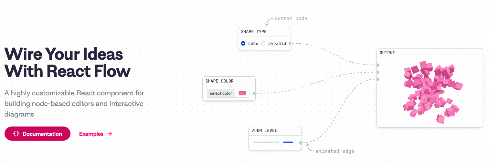

# React-Flow流程图库

# react-flow介绍

React Flow是一个基于React的流程图库，用于在Web应用程序中创建可交互的流程图和节点编辑器。它提供了一个可定制的组件集合，可以轻松地创建和管理节点、连接和布局。React Flow支持拖放、缩放、平移和连接节点等交互功能。

React Flow的主要特点包括：

1. 可定制性：React Flow的组件是可定制的，可以根据需要添加样式、事件处理程序和自定义逻辑。用户可以完全控制节点和连接的外观和行为。
2. 交互功能：React Flow提供了拖放、缩放、平移和连接节点等常见的交互功能。用户可以轻松地创建、修改和删除节点，以及连接它们。
3. 布局算法：React Flow内置了多种布局算法，包括树状布局、网格布局和力导向布局等。用户可以根据需要选择合适的布局算法，以确保流程图的可视化效果。
4. 扩展性：React Flow提供了丰富的API和事件钩子，以支持自定义行为和扩展。用户可以根据需要添加新的功能或修改现有功能。
5. 可视化效果：React Flow使用CSS和SVG等技术来绘制流程图，可以创建出美观、高度可定制的可视化效果。

总之，React Flow是一个强大且灵活的库，适用于构建各种类型的流程图和节点编辑器。无论是构建工作流程、图表、组织结构图还是其他类型的图形应用，React Flow都可以提供丰富的功能和良好的用户体验。

[文档](https://reactflow.dev/docs/quickstart/)

[react-flow github](https://github.com/wbkd/react-flow)

---

> 作者: 大卓  
> URL: https://nuoyang.tech/tech/other/react-flow/  

