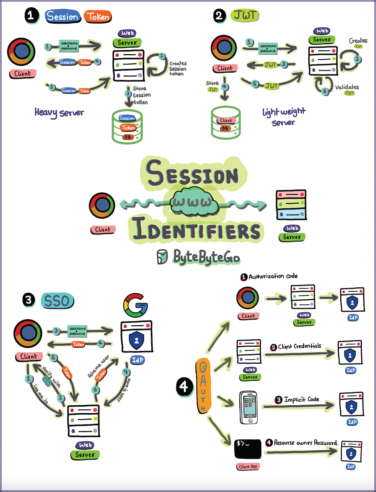

# 一张图说明Session、Token、JWT、SSO和OAuth

> 原文：[https://blog.bytebytego.com/p/sessions-tokens-jwt-sso-and-oauth?ref=dailydev](https://blog.bytebytego.com/p/sessions-tokens-jwt-sso-and-oauth?ref=dailydev)

---

> 作者: 大卓  
> URL: https://nuoyang.tech/tech/other/session_token_jwt_sso_oauth/  

